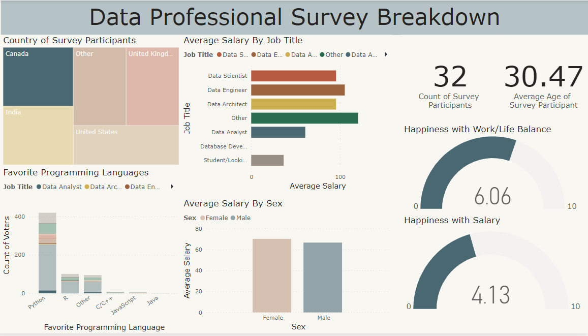
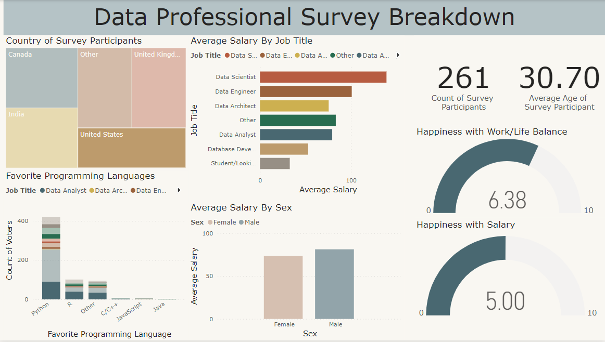
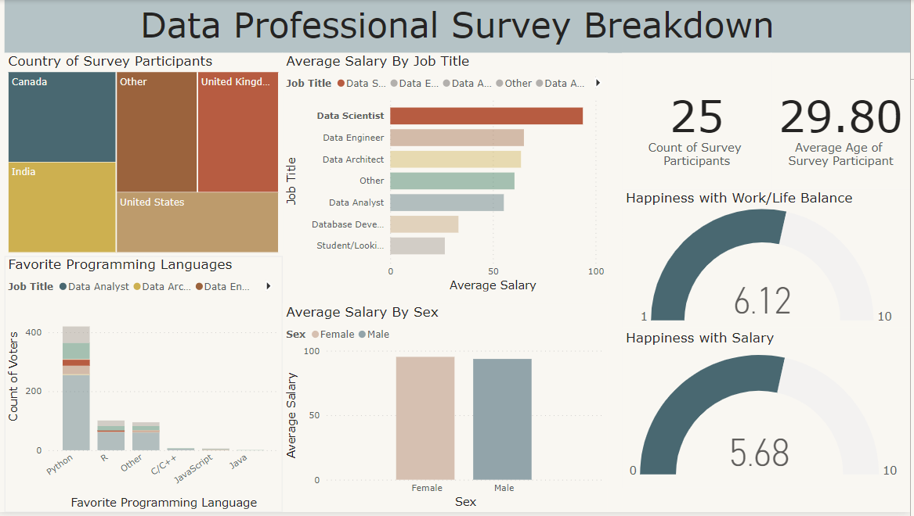
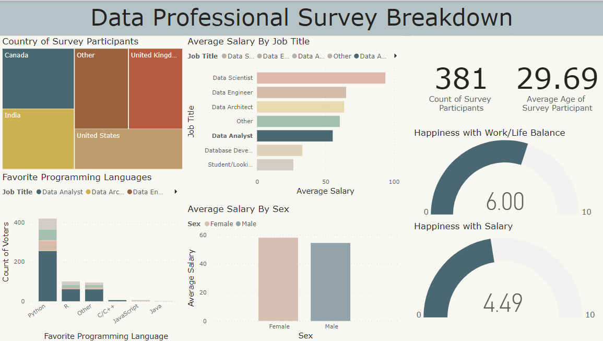
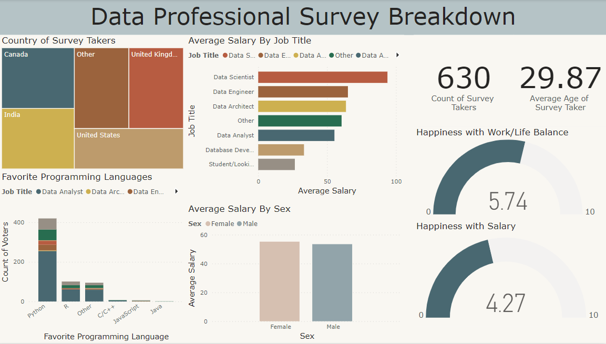

# Data Professional Dashboard Using PowerBI
## Objective
The goal of this project was to take survey information on Data Professionals and create a Dashboard using PowerBI.

## Data Tools and Understanding
The primary tool used in this project was PowerBI. PowerBI has an internal tool called PowerQuery that allows the modification of data if necessary. 

The data could be downloaded from this repository:

[Data](https://github.com/AlexTheAnalyst/Power-BI/blob/main/Power%20BI%20-%20Final%20Project.xlsx) 

The data will also be in included in this repository as well.

### <b>Cleaning</b>

Cleaning of information was needed in order to make the dashboard. Average Salary did not exist in the dataset but was calculated through the salary ranges given in the dataset. The salary ranges had to be processed since they were considered "text" and not numbers in the file.

Countries in the dataset had to be processed due to the "other" category. There were parentheses that had to be split from the "other" category and processed into one bucket. The same type of cleaning had to be done with the professional titles as they had the same concern.

### <b>Data Specifics</b>

In the Average Salary visualization, it shows that the highest average salary by Job title was a Data Scientist at about ~93k, followed by Data Engineer at ~65k and Data Architect at ~63k. The lowest was student at about ~26k. 

The tree map that lists the country of the survey takes has an interesting function. If one of the countries listed were to be clicked, it will change the Dashboard to show the breakdowns by the country. For example, let's take Average Salary By Sex between Canada and the US. According to the Tree Map, Women in Canada have a higher average salary than Men with about 70k average for Women and about 67k for Men. In the US however, Men have a higher average salary to Women at about 81k for Men and about 73k for Women according to this survey.





The total survey participants in this survey are 630 so the sample size is not that big considered the number of countries involved.

When it comes to the happiness of the Work/Life Balance and the Happiness with Salary, it could also be gauged by the job title as well. According the survey, ranging from 0-10 with 0 being extremely unhappy and 10 being extremely happy, the people who hold the job title of Data Scientist had an average rating of 6.12 for Happiness with Work/Life Balance and 5.68 for Happiness with Salary. The people who hold the job title of Data Analyst however, had an average rating of 6.00 for Happiness with Work/Life Balance and 4.49 for Happiness with Salary.




## Resulting Dashboard
This is the result of the dashboard without filtering. This takes into account all data of the survey.




## References
[Full Power BI Guided Project | Microsoft Power BI for Beginners - Alex The Analyst](https://www.youtube.com/watch?v=pixlHHe_lNQ) 

## Repository Structure

```
├── images
├── README.md
├── data_professional_survey_data.xlsx
└── power_bi_file.pbix
```
